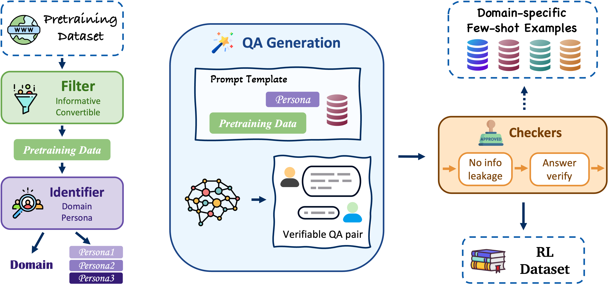

# Webscale-RL Data Pipeline

[](https://arxiv.org/abs/1234.56789)
[](https://huggingface.co/)


An automated data pipeline aims to scale up the RL datasets for LLM training to the webscale. It converts pretraining data into reinforcement learning (RL) datasets with question-answer format. It enables the creation of pretrain-scale RL datasets for LLM training while maintaining the diversity and quality of the original pretraining data.

## 🎯 Overview


The Webscale-RL pipeline employs a multi-stage approach to transform diverse pretraining materials into structured QA pairs suitable for RL training:

<div align="center">

</div>

1. **Filter**: Pre-processes and filters raw materials for quality
2. **Identifier**: Identifies domain classification and target persona
3. **Generator**: Creates question-answer pairs based on identified personas
4. **Checker**: Validates generated content for quality and correctness

### Key Features

- 🔄 **Multi-stage Pipeline**: Robust 4-stage processing ensuring high-quality output
- 🎭 **Persona-based Generation**: Creates diverse QA pairs from different persona perspectives
- 🏷️ **Diverse Domains**: Supports 10+ domains, beyond typical post-training datasets with specific domains such as Math, Coding, etc

## 🚀 Installation

### Prerequisites

- Python 3.8 or higher
- OpenAI API key

### Setup

1. Clone the repository:
  ```bash
  git clone https://github.com/SalesforceAIResearch/PretrainRL-pipeline
  cd PretrainRL-pipeline
  ```

2. Install the package:
  ```bash
  pip install -r requirements.txt
  pip install -e .
  ```

3. Set up your OpenAI API key:
  ```bash
  export OPENAI_API_KEY=your_api_key
  ```

## 📖 Usage

### Basic Usage (Single API Calls)

For standard processing with individual API calls:

```bash
python main.py \
    --model gpt-4.1 \
    --seed_dataset_dir [your_pretrain_data_dir] \
    --RL_dataset_save_dir data/RL_datasets \
    --RL_dataset_filename webscale_rl.jsonl \
    --failure_log_filename failure_log.jsonl \
    --workers 10
```

## ⚙️ Configuration

### Command Line Arguments

| Parameter | Type | Default | Description |
|-----------|------|---------|-------------|
| `--model` | str | `gpt-4.1` | OpenAI model to use |
| `--seed_dataset_dir` | str | `""` | The directory of the pretrain data |
| `--RL_dataset_save_dir` | str | `data/RL_datasets` | Output directory of RL datasets |
| `--RL_dataset_filename` | str | `webscale_rl.jsonl` | Output filename of RL datasets |
| `--failure_log_filename` | str | `failure_log.jsonl` | Failure log filename |
| `--temperature` | float | `1.0` | Model temperature |
| `--max-tokens` | int | `4096` | Maximum output tokens per request |
| `--num-fewshot` | int | `2` | Number of few-shot examples |
| `--seed` | int | `42` | Random seed |
| `--workers` | int | `10` | Number of parallel workers |

### Model Configuration

The pipeline supports configurable model settings for each stage:

- **Filter Stage**: Pre-processes raw materials
- **Identifier Stage**: Domain and persona identification
- **Generator Stage**: QA pair generation
- **Checker Stage**: Quality validation


## 📊 Output Format

The pipeline generates JSONL files with the following structure:

```json
{
  "original_text": "...",
  "domain": "Technology & Engineering",
  "persona": "Software Developer",
  "question": "What is the primary advantage of using microservices architecture?",
  "answer": "Microservices architecture allows for better scalability, maintainability, and independent deployment of services.",
  "metadata": "..."
}
```

## 🔧 Advanced Usage

**Custom Domain Configuration**

To add custom domains, you need to:
- modify the `ALL_DOMAINS` list in `webscale_rl/behavior_template/identifier.py`
- add the domain-specific few-shot examples in `webscale_rl/domain_specific_library/`
- modify the `FEW_SHOT_LIBRARY_PATH` in `webscale_rl/agent/agent.py` and ensure that all domains are added to the `FEW_SHOT_LIBRARY_PATH`

**Custom Persona Generation**

The system automatically identifies appropriate personas based on content. You can customize persona selection in the identifier template.

**Quality Control**

The pipeline includes multiple quality control mechanisms:
- Pre-filtering to remove low-quality pretraining materials
- Semantic validation for answer correctness
- Information leakage detection to prevent information leakage from question to answer
